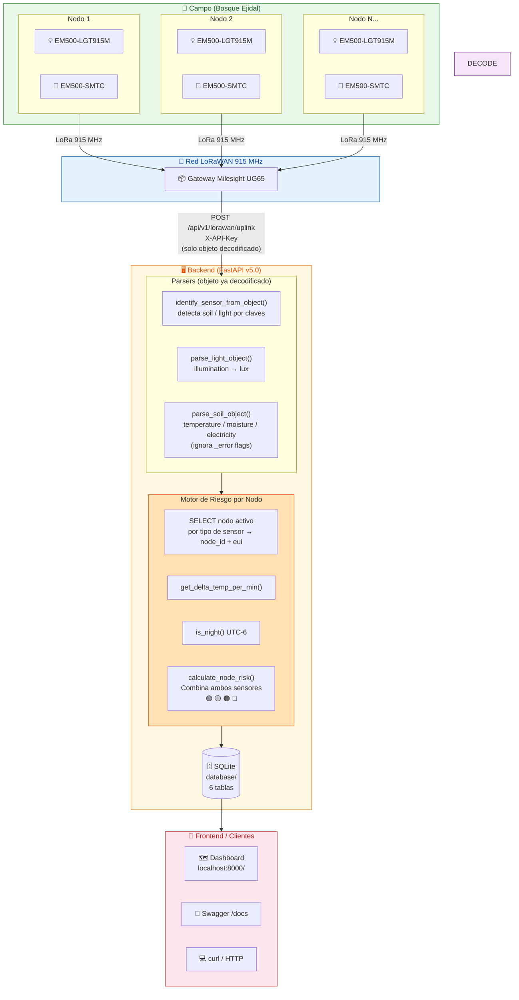
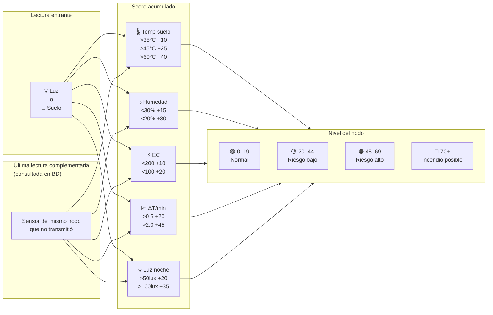
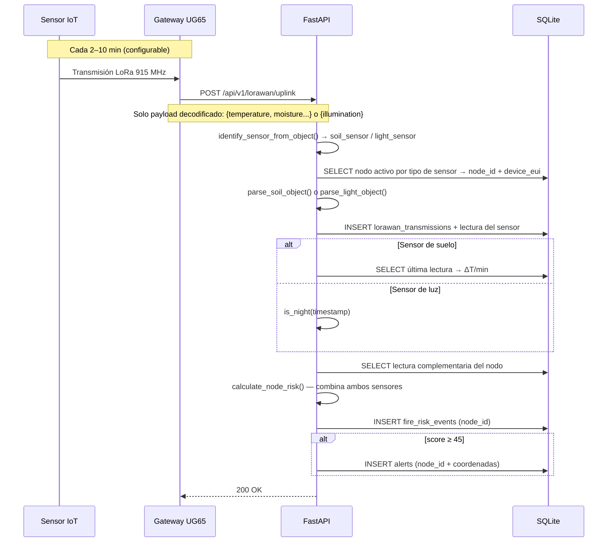

# Arquitectura — Detección de Incendios Forestales IoT

## Diagrama general



## Motor de riesgo — puntuación por nodo

Cada uplink combina la lectura actual con la última del sensor complementario del mismo nodo.



## Flujo de datos



## Endpoints

| Método | Endpoint | Descripción |
|---|---|---|
| `GET` | `/api/v1/health` | Estado del servidor |
| `POST` | `/api/v1/nodes` | Registrar un nodo |
| `GET` | `/api/v1/nodes` | Todos los nodos con riesgo actual → **mapa** |
| `GET` | `/api/v1/nodes/{id}` | Detalle + historial de un nodo |
| `DELETE` | `/api/v1/nodes/{id}` | Desactivar nodo |
| `POST` | `/api/v1/lorawan/uplink` | Recibe datos del gateway |
| `GET` | `/api/v1/fire-risk/current` | Último riesgo por nodo |
| `GET` | `/api/v1/fire-risk/history` | Historial de eventos |
| `GET` | `/api/v1/readings/light` | Lecturas de luz |
| `GET` | `/api/v1/readings/soil` | Lecturas de suelo |
| `GET` | `/api/v1/alerts` | Alertas ORANGE y RED (con coordenadas) |
| `GET` | `/api/v1/stats` | Estadísticas generales |

## Respuesta del endpoint de mapa `/api/v1/nodes`

```json
{
  "count": 2,
  "nodes": [
    {
      "id": 1,
      "name": "Nodo Norte",
      "latitude": 19.4326,
      "longitude": -99.1332,
      "light_eui": "24E124000001",
      "soil_eui": "24E124000002",
      "description": "Sector norte del ejido",
      "risk_level": "ORANGE",
      "risk_score": 55,
      "risk_label": "Riesgo alto — alerta al HUB",
      "risk_emoji": "🟠",
      "contributing_factors": ["temp_suelo_alta_>45C", "humedad_baja_<30pct"],
      "last_soil_reading": { "soil_temperature_celsius": 48, "soil_moisture_percent": 22 },
      "last_light_reading": { "light_lux": 12, "is_night": 1 },
      "last_seen": "2026-05-06T03:10:00"
    }
  ]
}
```

## Stack tecnológico

| Componente | Detalle |
|---|---|
| EM500-LGT915M | Luz — spike de lux detecta llamas |
| EM500-SMTC | Suelo — temperatura + humedad + EC |
| Gateway UG65 | Concentrador LoRaWAN 915 MHz |
| FastAPI | API REST + motor de riesgo + sirve el frontend |
| SQLite | BD local en `database/`, sin dependencias externas |
| React + Babel standalone | Dashboard — sin build step, recarga en el navegador |
| MapLibre GL JS | Mapa interactivo con marcadores por nivel de riesgo |
| venv | Entorno Python aislado en `backend/venv/` |

## Frontend — páginas y componentes

### `index.html` — Dashboard principal

| Componente | Archivo | Descripción |
|---|---|---|
| Mapa interactivo | `map-view.jsx` | Marcadores por nivel de riesgo (GREEN/YELLOW/ORANGE/RED), popups con métricas actuales |
| Panel lateral | `side-panel.jsx` | Lista de nodos ordenada por riesgo + alertas globales con dismiss |
| Panel inferior | `detail-panel.jsx` | Se abre al seleccionar un nodo: 4 métricas grandes + gráfica de temperatura 24h |
| Tweaks | `tweaks-panel.jsx` | Selector de tema claro/oscuro y ajustes de visualización |

### `nodo.html` — Detalle de nodo

Página completa accesible desde `/nodo.html?id=NODE-001`. Componentes principales:

| Componente | Descripción |
|---|---|
| Hero + estado | Nombre, área, coordenadas, nivel de riesgo, baterías, último visto |
| 4 métricas grandes | Temp. suelo, Humedad, Iluminación, Electroconductividad (valor actual + contexto) |
| Series temporales 24h | 4 charts independientes en grid 2×2, cada una con eje Y en unidades reales (`°C`, `%`, `lux`, `dS/m`) |
| Tendencias por variable | 4 sparklines con rango min→max de las últimas 24h |
| Alertas del nodo | Lista paginada (3 por página) con dismiss individual y "marcar todas como leídas" |
| Especificaciones | EUIs de sensores y coordenadas GPS |

### Datos compartidos — `data.jsx`

Módulo global (`window.fireZenseAPI`) que expone:
- `getNodes()` — GET `/api/v1/nodes`, transforma al modelo de UI
- `getAlerts()` — GET `/api/v1/alerts`, normaliza campos
- `RISK_META` — mapa de nivel → color, label, bg para badges y gráficas
