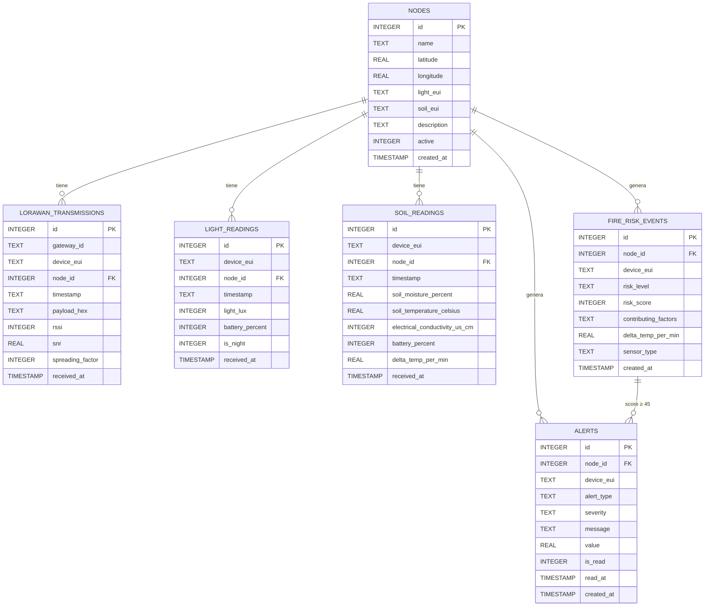
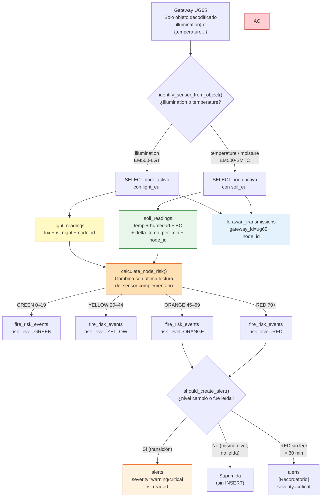

# Diagrama de Base de Datos — Detección de Incendios

## Esquema Entidad-Relación

## Flujo de escritura

## Detalle de tablas

### `nodes` — Catálogo de nodos (tabla central)
| Campo | Tipo | Descripción |
|---|---|---|
| `name` | TEXT | Nombre del nodo, ej. "Nodo Norte" |
| `latitude` | REAL | Latitud GPS |
| `longitude` | REAL | Longitud GPS |
| `light_eui` | TEXT | EUI del EM500-LGT915M asignado |
| `soil_eui` | TEXT | EUI del EM500-SMTC asignado |
| `description` | TEXT | Notas del sitio |
| `active` | INTEGER | 1 = activo, 0 = desactivado |

### `lorawan_transmissions` — Raw de todos los uplinks
| Campo | Tipo | Descripción |
|---|---|---|
| `node_id` | INTEGER FK | Nodo al que pertenece (null si no registrado) |
| `device_eui` | TEXT | EUI del sensor |
| `payload_hex` | TEXT | Payload crudo en hex |
| `rssi` | INTEGER | Potencia de señal (dBm) |
| `snr` | REAL | Relación señal/ruido (dB) |

### `light_readings` — EM500-LGT915M
| Campo | Tipo | Descripción |
|---|---|---|
| `node_id` | INTEGER FK | Nodo al que pertenece |
| `light_lux` | INTEGER | Intensidad de luz |
| `is_night` | INTEGER | 1 si era de noche en hora México (UTC-6) |
| `battery_percent` | INTEGER | Batería del sensor |

**Umbrales:** noche >50 lux +20pts / >100 lux +35pts · día >50,000 lux +15pts

### `soil_readings` — EM500-SMTC
| Campo | Tipo | Descripción |
|---|---|---|
| `node_id` | INTEGER FK | Nodo al que pertenece |
| `soil_temperature_celsius` | REAL | Normal 15–28°C · score >35°C (+10) / >45°C (+25) / >60°C (+40) |
| `soil_moisture_percent` | REAL | Normal 8–16 % · alerta <8% (+15) · crítico <7% (+30) |
| `electrical_conductivity_us_cm` | INTEGER | Normal ≥200 µS/cm · seco <200 (+10) · muy seco <100 (+20) |
| `delta_temp_per_min` | REAL | ΔT respecto a lectura anterior · >0.5°C/min (+20) · >2°C/min (+45) |
| `battery_percent` | INTEGER | Batería del sensor |

### `fire_risk_events` — Riesgo calculado a nivel nodo
| Campo | Tipo | Descripción |
|---|---|---|
| `node_id` | INTEGER FK | Nodo evaluado |
| `risk_level` | TEXT | GREEN / YELLOW / ORANGE / RED |
| `risk_score` | INTEGER | Score acumulado 0–100+ |
| `contributing_factors` | TEXT | Factores que sumaron puntos |
| `delta_temp_per_min` | REAL | ΔT de esa lectura |
| `sensor_type` | TEXT | Sensor que disparó el cálculo |

### `alerts` — Alertas accionables (ORANGE y RED)
| Campo | Tipo | Descripción |
|---|---|---|
| `node_id` | INTEGER FK | Nodo en alerta (incluye lat/lng al consultar) |
| `alert_type` | TEXT | `fire_risk_orange` / `fire_risk_red` |
| `severity` | TEXT | `warning` / `critical` |
| `message` | TEXT | Descripción legible con emoji y factores. Prefijo `[Recordatorio]` en alertas RED periódicas |
| `value` | REAL | Score que disparó la alerta |
| `is_read` | INTEGER | `0` = no leída, `1` = leída. El GET filtra solo `is_read=0` por defecto |
| `read_at` | TIMESTAMP | Momento en que fue marcada como leída (UTC) |

**Lógica de deduplicación (`should_create_alert`):**
- Sin alertas previas → crear
- El nivel cambió respecto a la última alerta → crear
- Mismo nivel, última alerta creada hace < 1 min → suprimir (guard anti-duplicados soil+light)
- Mismo nivel, alerta leída → crear nueva después de 15 min desde `read_at`
- Mismo nivel, no leída, RED → recordatorio cada 30 min
- Mismo nivel, no leída, ORANGE → suprimir
